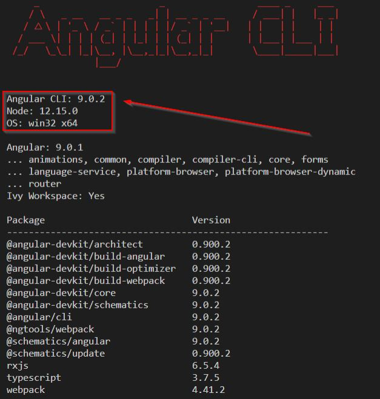
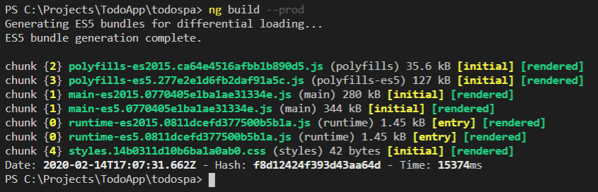
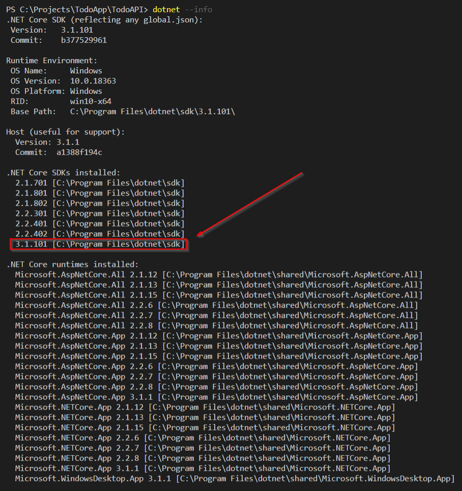
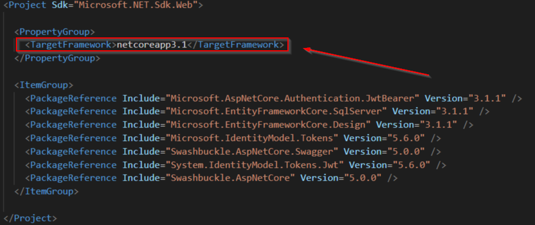

# TodoApp

DotnetCore(v2.2) / Angular(v8.3) / DemoApp

 
 

# DotnetCore v2.2

- NetCoreWebApi
- Authorization
- RoleBasedAPI
- NSwagStudio
- MSSqlServer
- SwaggerApi
- JWToken
- DBFirst 
- EFCore

# Angular v8.3

- TypeScript / HTML / CSS
- Async Calls / Subscribe
- Components / Services
- Component Interaction
- Dependency Injection
- AuthGuard / Routing
- @Outputs / @Inputs
- JWT Interceptor
- ERR Interceptor
- Data Binding
- LocalStorage
- Bootstrap 
- RxJS

# Upgrade to Angular v9.0 

 
 

# Upgrade to NetCore v3.1
 
 

# Adding DEV & PROD profile to API

    "DEV": {
      "commandName": "Project",
      "applicationUrl": "http://localhost:5200;https://localhost:5300",
      "environmentVariables": { "ASPNETCORE_ENVIRONMENT": "Development" }
    },

    "PRD": {
      "commandName": "Project",
      "applicationUrl": "http://localhost:5400;https://localhost:5500",
      "environmentVariables": { "ASPNETCORE_ENVIRONMENT": "Production" }
    }    

    dotnet run --launch-profile DEV

    info: Microsoft.Hosting.Lifetime[0] Now listening on: http://localhost:5200
    info: Microsoft.Hosting.Lifetime[0] Now listening on: https://localhost:5300
    info: Microsoft.Hosting.Lifetime[0] Application started. Press Ctrl+C to shut down.
