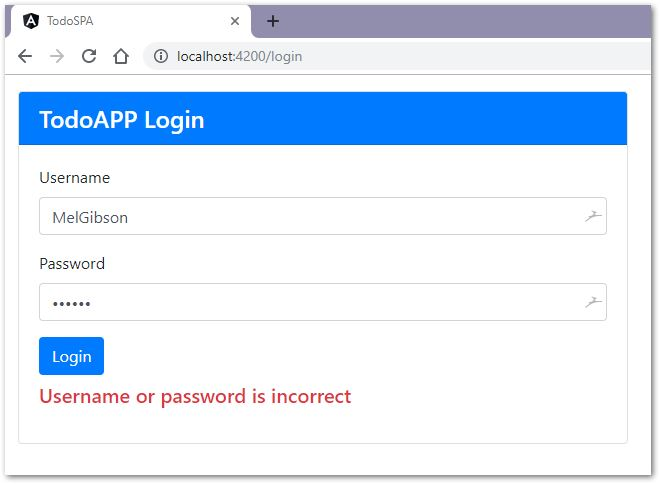
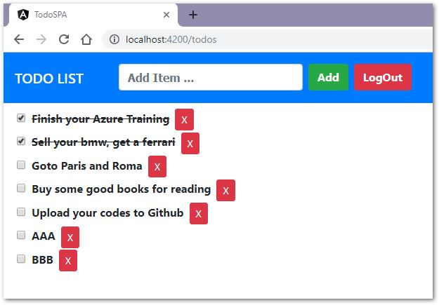

# TodoApp

DotnetCore(v2.2) / Angular(v8.3) / DemoApp

 
 

# DotnetCore v2.2

- NetCoreWebApi
- Authorization
- RoleBasedAPI
- NSwagStudio
- MSSqlServer
- SwaggerApi
- JWToken
- DBFirst 
- EFCore

# Angular v8.3

- TypeScript / HTML / CSS
- Async Calls / Subscribe
- Components / Services
- Component Interaction
- Dependency Injection
- AuthGuard / Routing
- @Outputs / @Inputs
- JWT Interceptor
- ERR Interceptor
- Data Binding
- LocalStorage
- Bootstrap 
- RxJS
