# TodoApp

DotnetCore(v2.2) / Angular(v8.3) / DemoApp

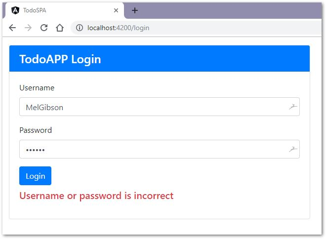 
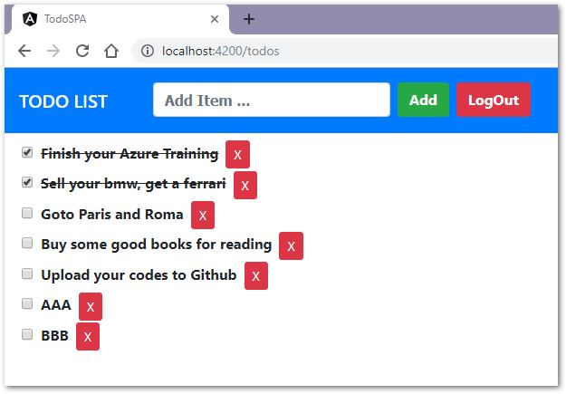 

# DotnetCore v2.2

- NetCoreWebApi
- Authorization
- RoleBasedAPI
- NSwagStudio
- MSSqlServer
- SwaggerApi
- JWToken
- DBFirst 
- EFCore

# Angular v8.3

- TypeScript / HTML / CSS
- Async Calls / Subscribe
- Components / Services
- Component Interaction
- Dependency Injection
- AuthGuard / Routing
- @Outputs / @Inputs
- JWT Interceptor
- ERR Interceptor
- Data Binding
- LocalStorage
- Bootstrap 
- RxJS

# Upgrade to Angular v9.0 

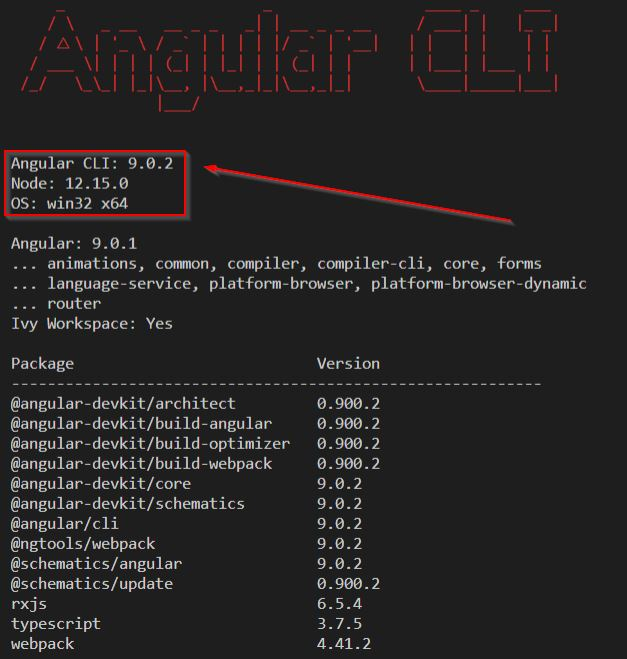 
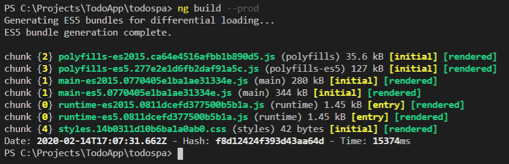 

# Upgrade to NetCore v3.1
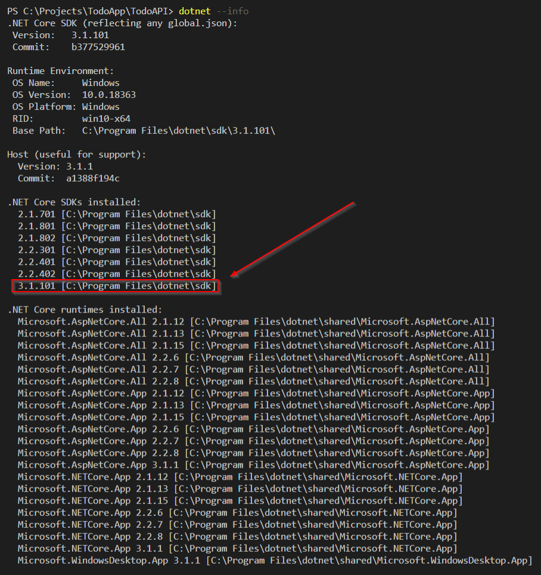 
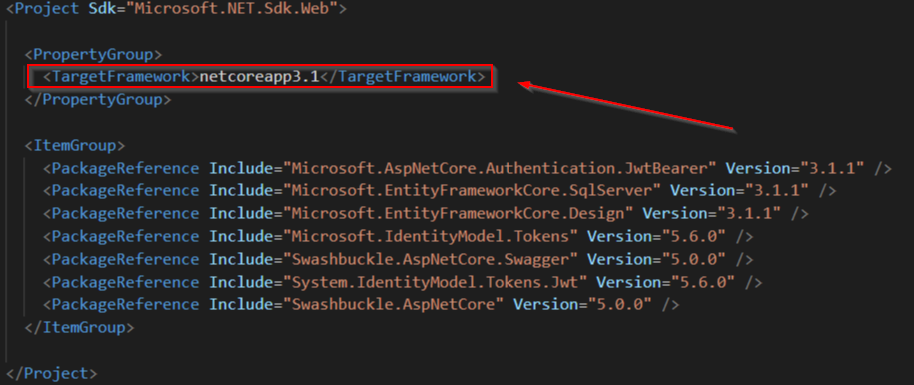 

# Adding DEV & PRD profile to API

    "DEV": {
      "commandName": "Project",
      "applicationUrl": "http://localhost:5200;https://localhost:5300",
      "environmentVariables": { "ASPNETCORE_ENVIRONMENT": "Development" }
    },

    "PRD": {
      "commandName": "Project",
      "applicationUrl": "http://localhost:5400;https://localhost:5500",
      "environmentVariables": { "ASPNETCORE_ENVIRONMENT": "Production" }
    }    

    >> dotnet run --launch-profile DEV

    info: Microsoft.Hosting.Lifetime[0] Now listening on: http://localhost:5200
    info: Microsoft.Hosting.Lifetime[0] Now listening on: https://localhost:5300
    info: Microsoft.Hosting.Lifetime[0] Application started. Press Ctrl+C to shut down.

# Adding API URL to SPA Config

    [index.html]
    ....
      
    </head>
    ....

    [app.config.js]
    ....
      var URL_TodoAPIClient = "http://localhost:5200";
    ....

    [app.module.ts]
    ....
      { provide: URL_TodoAPIClient, useValue: window["URL_TodoAPIClient"] },
    ....

# Adding Dockerfile to API

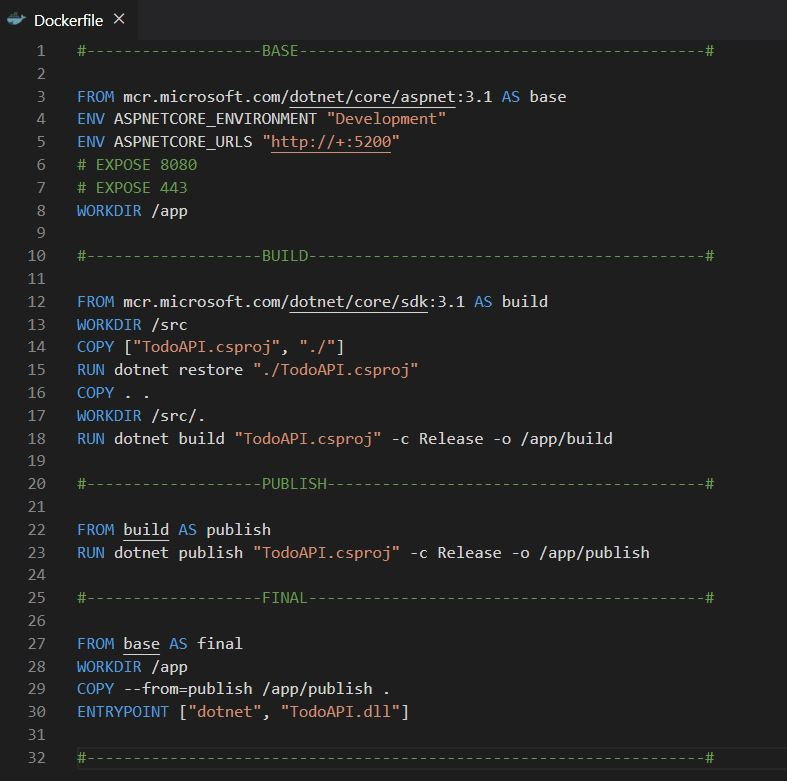 

    >> docker build . -t hy2015tr/todoapi

    >> docker run -p 8080:5200 --name todoapi hy2015tr/todoapi 

# Adding Docker-Compose to Solution

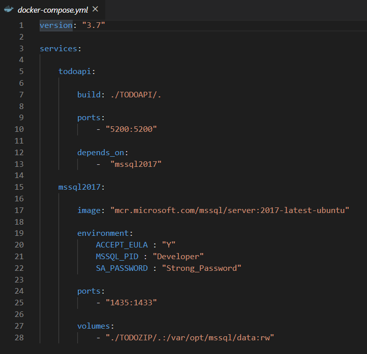 

    >> docker-compose up --build

# MSSQL Server Start and Restore Database

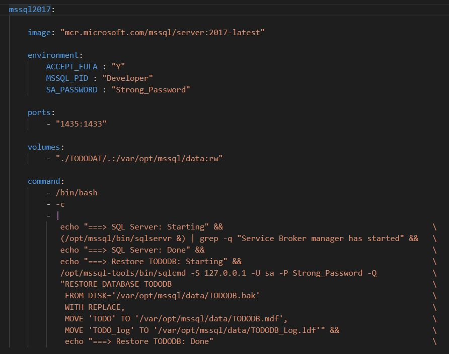 

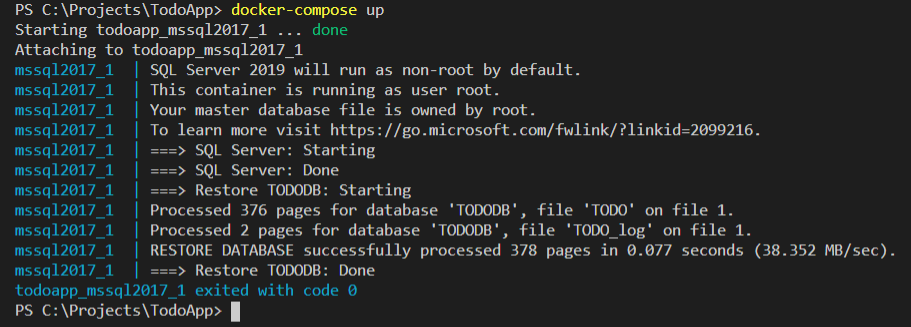 

# Linux Bash Notes

( from stackoverflow.com)

- [ ;  ] ---> Commands separated by a ; are executed sequentially. The shell waits for each command to terminate in turn.
- [ && ] ---> Command after && is executed if, and only if, command before && returns an exit status of zero. You can think of it as AND operator.
- [ |  ] ---> A pipe. In expression command1 | command2 The standard output of command1 is connected via a pipe to the standard input of command2.
- [ || ] ---> Command after || is executed if, and only if, command before || returns a non-zero exit status. You can think of it as OR operator. Please note, that | and || are completely different animals.
- [ &  ] ---> The shell executes the command terminated by & in the background, does not wait for the command to finish and immediately returns exit code 0. Once again, & has nothing to do with &&.
- [ |& ] ---> A shorthand for 2>&1 | i.e. both standard output and standard error of command1 are connected to command2's standard input through the pipe.

Consider two commands A and B. When you write:

- A | B ---> A and B are executed in parallel, and the standard output of A is sent as the standard input of B.
- A ; B ---> A is executed, then B is executed (unless set -e has been used and A terminates with a non-zero exit status, in which case the shell terminates just after A).
- A && B ---> A is executed, then B is executed only if A has terminated successfully (zero exit status). This form can be safer than the previous one, e.g. with
- cd some_dir && rm file ---> The && makes sure that the right files are removed, i.e. files are removed only if the cd has succeeded.

# Adding Bash Script File

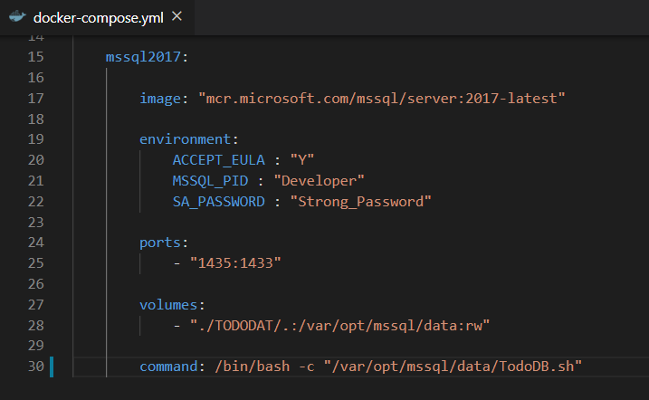 

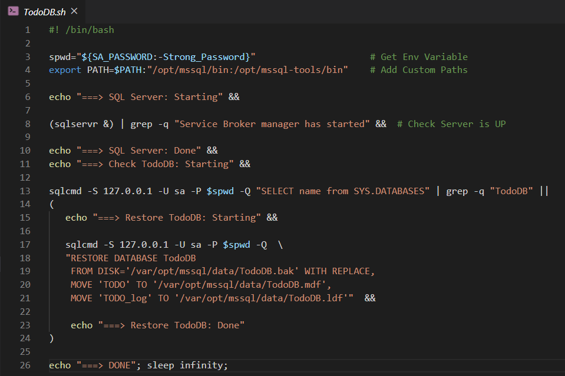 

# Building Docker-Compose Services

    >> docker-compose up --build

  <a href="TodoZIP/Docs/TodoAPP.html"> Build Result as HTML Format</a>

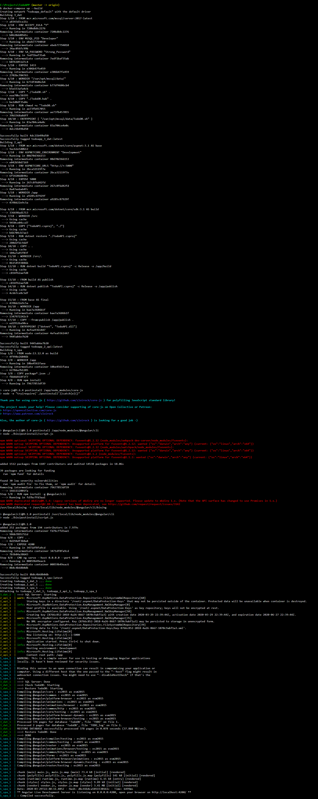 

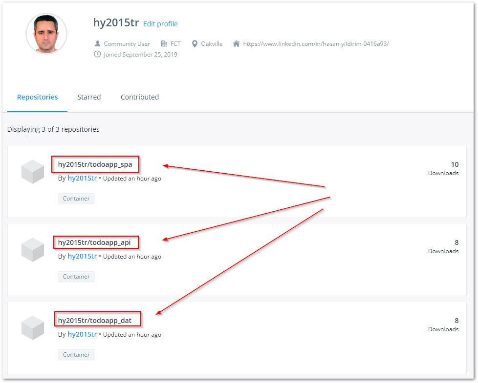 

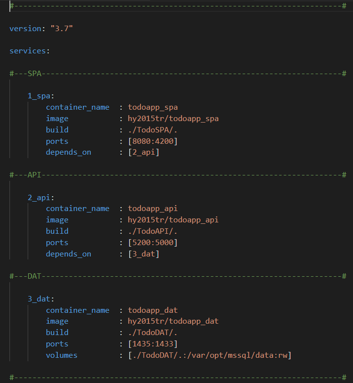 

# GIT Notes

    >> git --version

    git version 2.23.0.windows.1

    git config --system --edit   (ProgramFiles\Git)
    git config --global --edit   (Users\HY)
    git config --local --edit    (Project)

    core.autocrlf=false  (Win + MacOS + Linux)

    MAC ==> LF 
    LNX ==> LF
    WIN ==> CRLF

    Never turn autocrlf ON:  

    it causes nothing but headaches and sorrows. There's no excuse to use \r\n on windows,  all decent editors (by definition) can handle \n.

    [ 1 ] Solution Project Level:

    Put a .gitattributes file in the root of your git repository having following contents: text=auto eol=lf

    [ 2 ] Check "core" Field in Git Settings:

    >> git config --list  --show-origin | grep "core."

    file:C:/Program Files/Git/etc/gitconfig core.fscache=true
    file:C:/Program Files/Git/etc/gitconfig core.symlinks=false
    file:C:/Program Files/Git/etc/gitconfig core.editor="C:\\Program Files\\Notepad++\\notepad++.exe" -multiInst -notabbar -nosession -noPlugin
    
    file:C:/Users/hasan.yildirim/.gitconfig core.editor="C:/Program Files (x86)/GitExtensions/GitExtensions.exe" fileeditor
    file:C:/Users/hasan.yildirim/.gitconfig core.autocrlf=false
    
    file:.git/config  core.repositoryformatversion=0
    file:.git/config  core.filemode=false
    file:.git/config  core.bare=false
    file:.git/config  core.logallrefupdates=true
    file:.git/config  core.symlinks=false
    file:.git/config  core.ignorecase=true